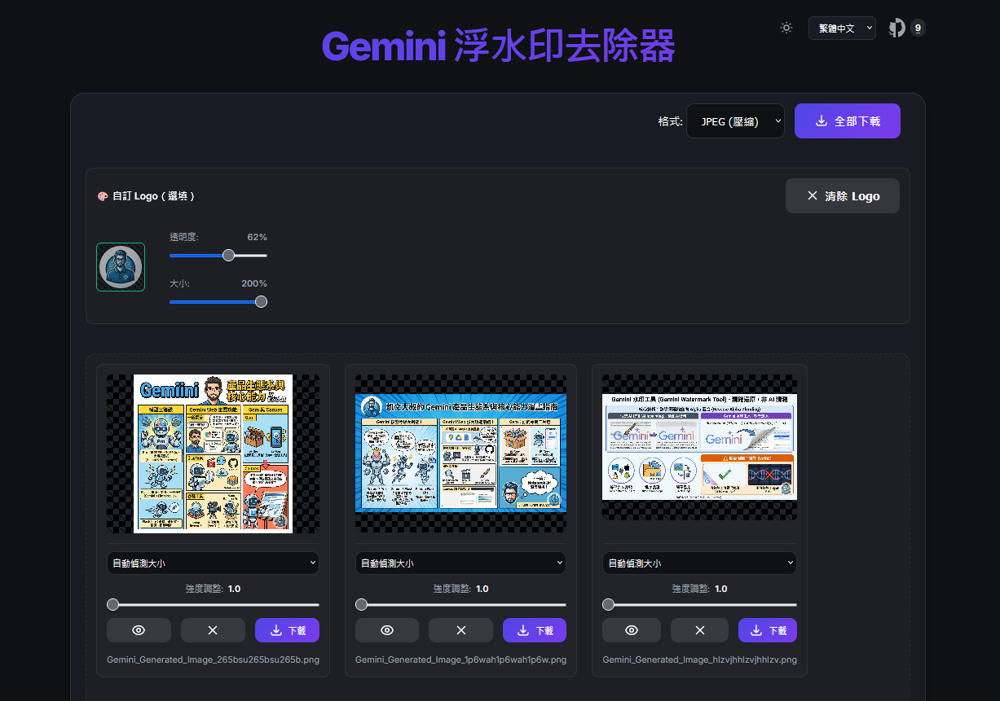

# Gemini Watermark Remover

[English](README.md) | [繁體中文](README_zh-TW.md) | [简体中文](README_zh-CN.md) | [日本語](README_ja.md) | [한국어](README_ko.md)

Google Gemini가 생성한 이미지의 워터마크를 제거하도록 특별히 설계된 강력한 웹 도구입니다. 이 도구는 브라우저에서 완전히 실행되므로 이미지를 서버에 업로드할 필요가 없어 개인 정보가 안전하게 보호됩니다.

## ✨ 주요 기능

- **🚫 자동 워터마크 제거**: 역 알파 블렌딩 알고리즘(Reverse Alpha Blending)을 사용하여 워터마크로 덮인 픽셀을 정밀하게 복원합니다.
- **🎨 사용자 지정 로고 교체**: 자신의 로고 이미지를 업로드하여 원래 워터마크 위치를 대체하고 투명도(0% ~ 100%) 및 크기(10% ~ 200%)를 조정할 수 있습니다.
- **🔒 개인 정보 우선**: 모든 처리는 로컬 브라우저에서 완료되며 이미지는 기기를 떠나지 않습니다.
- **⚡ 즉시 미리보기**: 업로드 즉시 처리되어 결과를 빠르게 확인할 수 있습니다.
- **🖱️ 드래그 앤 드롭 지원**: 이미지를 창으로 직접 드래그하여 처리할 수 있습니다.
- **👀 비교 모드**: 처리된 이미지를 길게 누르면 원본 이미지를 볼 수 있어 제거 효과를 쉽게 비교할 수 있습니다.
- **⚙️ 스마트 및 수동 모드**:
  - **자동 감지**: 이미지 해상도에 따라 워터마크 크기를 자동으로 판단합니다.
  - **수동 선택**: 특수한 상황에 대응하기 위해 소형(48px) 또는 대형(96px) 모드를 강제로 선택할 수 있습니다.
- **💾 고화질 다운로드**: 처리된 이미지를 한 번의 클릭으로 다운로드할 수 있습니다(PNG 또는 JPEG 형식).
- **🌐 다국어 지원**: 인터페이스는 English, 繁體中文, 简体中文, 日本語, 한국어를 지원합니다.

## 🛠️ 기술 원리

이 프로젝트는 순수 JavaScript(Canvas API)로 구현되었습니다. Gemini 워터마크의 알파 마스크를 미리 로드하고 각 픽셀의 원본 색상 값을 계산하여 워터마크의 영향을 "역산"함으로써 무손실 또는 흔적 없는 제거 효과를 달성합니다.

## 🚀 사용 방법

1. **웹 페이지 열기**: 브라우저에서 `index.html`을 직접 엽니다.
2. **이미지 업로드**: 업로드 영역을 클릭하여 이미지를 선택하거나 JPG/PNG/WEBP 이미지를 직접 드래그합니다.
3. **결과 확인**: 시스템이 자동으로 처리하고 결과를 표시합니다.
4. **설정 조정** (필요한 경우): 결과가 좋지 않으면 드롭다운 메뉴에서 "Force Small" 또는 "Force Large"로 전환해 보세요.
5. **다운로드**: 만족스러우면 "Download" 버튼을 클릭하여 이미지를 저장합니다.



## 📦 설치 및 실행

이 프로젝트는 정적 웹 페이지이므로 복잡한 백엔드 환경을 설치할 필요가 없습니다.

1. **프로젝트 클론**:
   ```bash
   git clone https://github.com/kevintsai1202/GeminiWatermarkRemove.git
   ```
2. **디렉토리 이동**:
   ```bash
   cd GeminiWatermarkRemove
   ```
3. **실행**:
   `index.html`을 브라우저에서 직접 열어 사용할 수 있습니다.
   *주의: 브라우저 보안 정책(CORS)으로 인해 로컬 파일을 직접 열면 마스크 이미지 로드에 실패할 수 있습니다. Python 등을 사용하여 간단한 로컬 서버를 실행하는 것이 좋습니다:*
   ```bash
   # Python 3
   python -m http.server 8000
   ```

   그런 다음 브라우저에서 `http://localhost:8000`에 접속하십시오.

## 📄 라이선스

이 프로젝트는 연구 및 학습 목적으로만 제공됩니다. 이 도구를 사용하여 이미지를 처리할 때 관련 법규를 준수하십시오.
