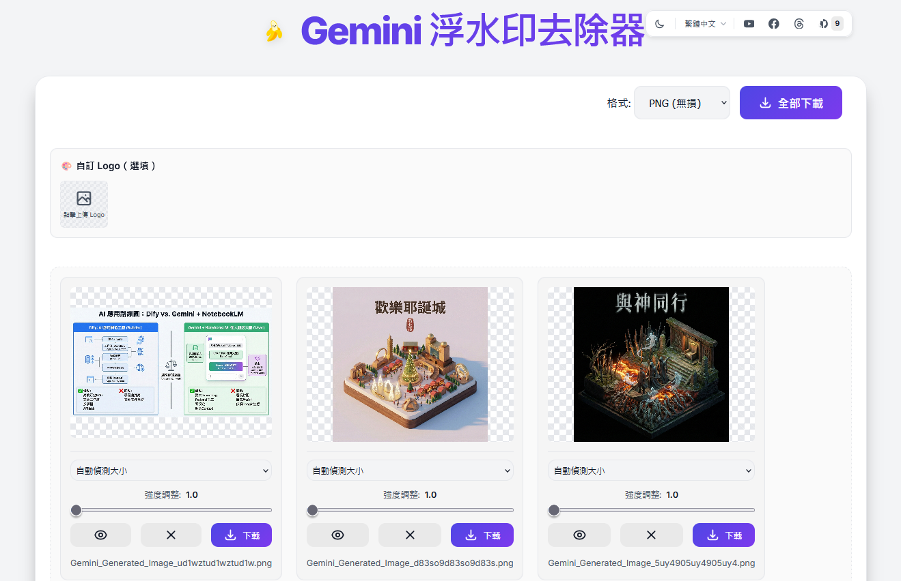
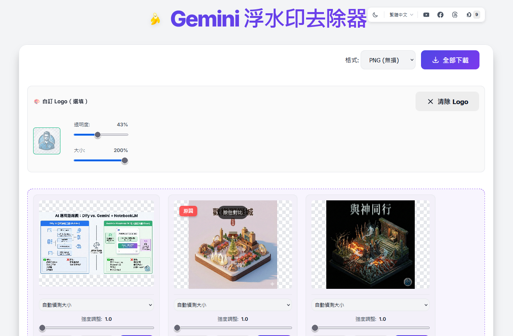

# Gemini Watermark Remover

[](https://opensource.org/licenses/MIT)

[English](README.md) | [繁體中文](README_zh-TW.md) | [简体中文](README_zh-CN.md) | [日本語](README_ja.md) | [한국어](README_ko.md)

這是一個強大的網頁工具，專門設計用於去除由 Google Gemini 生成圖片中的浮水印。此工具完全在瀏覽器端運行，無需將圖片上傳至伺服器，確保您的隱私安全。

## 🖼️ 實際演示

<div align="center">
  
  
</div>


## ✨ 主要功能

- **🚫 自動去除浮水印**：利用逆向 Alpha 混合演算法（Reverse Alpha Blending），精確還原被浮水印覆蓋的像素。
- **🎨 自訂 Logo 替換**：上傳您的 Logo 圖片，取代原本浮水印位置，並可調整透明度（0% ~ 100%）及大小（10% ~ 200%）。
- **🔒 隱私優先**：所有處理皆在您的本地瀏覽器中完成，圖片不會離開您的裝置。
- **⚡ 即時預覽**：上傳即處理，快速查看結果。
- **🖱️ 拖拽支援**：支援將圖片直接拖拽至視窗進行處理。
- **👀 對比模式**：長按處理後的圖片即可查看原始圖片，方便比較去除效果。
- **⚙️ 智慧與手動模式**：
  - **自動偵測**：根據圖片解析度自動判斷浮水印大小。
  - **手動選擇**：可強制選擇小（48px）或大（96px）浮水印模式以應對特殊情況。
- **💾 高畫質下載**：一鍵下載處理後的圖片，支援 PNG（無損）或 JPEG（壓縮）格式。
- **📱 PWA 支援**：支援安裝為桌面/手機應用程式，並可離線使用。
- **📋 剪貼簿貼上**：支援直接貼上 (Ctrl+V) 截圖或圖片進行處理。
- **📦 批次 ZIP 下載**：下載多張圖片時自動打包為 ZIP 檔案，方便整理。
- **🌐 多國語系支援**：介面支援英文、繁體中文、簡體中文、日文及韓文。

## 🛠️ 技術原理

此專案使用純 JavaScript (Canvas API) 實作。它預先載入了 Gemini 浮水印的 Alpha 遮罩（Mask），並通過計算每個像素的原始顏色值來「反算」扣除浮水印的影響，從而達到無損或近乎無痕的去除效果。

## 🚀 如何使用

1. **開啟網頁**：直接在瀏覽器中打開 `index.html`。
2. **上傳圖片**：點擊上傳區域選擇圖片，或直接將 JPG/PNG/WEBP 圖片拖入。
3. **查看結果**：系統會自動處理並顯示結果。
4. **調整設定**（如有需要）：如果效果不佳，可以嘗試在下拉選單中切換「Force Small」或「Force Large」。
5. **下載**：滿意後點擊「Download」按鈕保存圖片。

## 📦 安裝與執行

本專案為靜態網頁，無需安裝複雜的後端環境。

1. **複製專案**：
   ```bash
   git clone https://github.com/kevintsai1202/GeminiWatermarkRemove.git
   ```
2. **進入目錄**：
   ```bash
   cd GeminiWatermarkRemove
   ```
3. **執行**：
   直接用瀏覽器打開 `index.html` 即可使用。
   *注意：由於瀏覽器安全策略（CORS），若直接開啟本地檔案可能會導致遮罩圖片載入失敗。建議使用簡單的本地伺服器運行，例如使用 Python：*
   ```bash
   # Python 3
   python -m http.server 8000
   ```

   然後在瀏覽器訪問 `http://localhost:8000`。

## 🖥️ 桌面應用程式 (Tauri)

除了網頁版本，我們也提供使用 [Tauri](https://tauri.app/) 建置的原生桌面應用程式。

### 特色功能
- **離線使用**：無需網路連線即可運作
- **原生效能**：透過原生 API 提供更快的檔案處理
- **獨立運行**：無需瀏覽器即可執行

### 下載
> 即將推出 - 請至 [Releases](https://github.com/kevintsai1202/GeminiWatermarkRemove/releases) 頁面下載安裝包。

### 從原始碼建置
```bash
# 前置需求：Rust、Node.js
cargo install tauri-cli

# 複製並建置
git clone https://github.com/kevintsai1202/GeminiWatermarkRemove.git
cd GeminiWatermarkRemove
git checkout feature/tauri-app

# 開發模式
cargo tauri dev

# 建置安裝包
cargo tauri build
```
輸出位置：`src-tauri/target/release/bundle/`


## 🙏 致謝 (Acknowledgements)

特別感謝 [GeminiWatermarkTool](https://github.com/allenk/GeminiWatermarkTool) 專案提供的重要資訊與靈感。

## 📄 授權條款 (License)

本專案採用 MIT 授權條款。詳細內容請參閱 [LICENSE](LICENSE) 文件。

